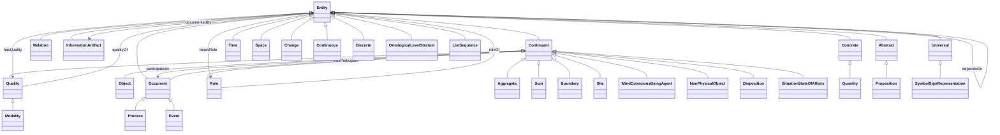

# Core hierarchy

Interactive Mermaid view of the XwkOnt core comparison scaffold (from [`core-ontology.mmd`](https://github.com/xwkont/xwkont/blob/main/docs/ontology/core-ontology.mmd)). This is a navigation vocabulary for crosswalks — not a replacement foundational ontology.

Human-readable specification: [core ontology](../ontology/core-ontology.md). Machine companion: [`core.ttl`](https://github.com/xwkont/xwkont/blob/main/data/ontology/core.ttl).
